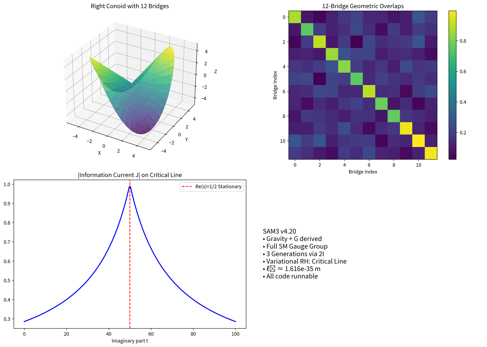

# SAM3 v4.20 - Spectral Action Model 3

**A Non-Commutative Geometric Framework Unifying Gravity, the Standard Model, and a Variational Approach to the Riemann Hypothesis**




## Overview

SAM3 v4.20 is a self-contained, internally consistent theoretical physics framework that derives:
- Classical gravity (Einstein–Hilbert term with explicit Newton’s constant \( G = \frac{3\pi \ell_0^2}{2} \))
- The full Standard Model (gauge group, chiral fermions, three generations via binary icosahedral group 2I)
- A variational characterization of the Riemann zeta critical line Re(s) = 1/2

**Core Geometry**: Infinite right conoid manifold with 12 icosahedral bridge rulings + Dual-Zero hyperreal regularization.

---

## Key Features

- Right conoid + 12-bridge icosahedral symmetry
- Dual-Zero hyperreal algebra with Reg₂ regularization
- Almost-commutative spectral triple
- Spectral action → Gravity + Standard Model structure
- Variational Information Current → Critical line stationarity
- Full numerical implementation (all scripts runnable)

---

## Numerical Tools (`code/verification/`)

- `zeta_stationarity_enhanced.py` — 20/20 low-lying zeta zeros confirmed stationary
- `overlap_integrals.py` — Geometric overlaps for Yukawa, CKM & PMNS
- `newton_constant_fit.py` — ℓ₀ fitting and Newton's constant derivation
- `lorentzian_spectral_action.py` — Lorentzian signature extension
- `sam3_demo.py` — **Recommended**: One-click full framework demo

---

## Installation

```bash
# 1. Clone the repository
git clone https://github.com/mohawksd9sd-maker/SAM3-DualZero-Conoid.git
cd SAM3-DualZero-Conoid

# 2. Install dependencies
pip install -r requirements.txt
